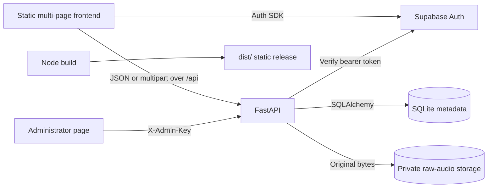

# KP AWAZ — Working MVP

KP AWAZ is a community voice-contribution platform for Pashto and the local
languages of Khyber Pakhtunkhwa. Contributors create a verified account, read a
prompt or provide their own words, record audio in the browser, give versioned
consent, and submit the recording for administrator review.

This repository contains the complete Stage A MVP:

- A 14-page static frontend built with HTML, CSS, and JavaScript modules
- Supabase email/password, six-digit OTP, password recovery, and Google OAuth
- A FastAPI application with SQLAlchemy and SQLite
- Original-format private audio storage
- Contributor profiles, ownership, consent, review states, and withdrawals
- Administrator contribution review and Pashto phrase management
- Approved-contribution scoring and a privacy-safe public leaderboard
- Backup, storage-health, restore, and internal export command-line tools

The MVP collects and preserves recordings. It does **not** convert audio into a
training format, automatically judge speech quality, train an AI model, publish
recordings, or permanently delete data from a browser action.

## Architecture at a glance



The responsibilities are intentionally separated:

| Layer | Responsibility |
| --- | --- |
| HTML pages and `sections/` | Semantic page structure and reusable partials |
| `styles/` | Shared design tokens, public styles, workspace styles, responsive behavior, and final visual polish |
| Page applications in `scripts/*-app.js` | Bootstrap one page and coordinate its modules |
| `scripts/modules/` | UI state, rendering, recording, navigation, and lifecycle cleanup |
| `scripts/services/` | Validate browser data and perform all Supabase or FastAPI communication |
| `backend/app/routes/` | HTTP contracts, authentication dependencies, and safe response envelopes |
| `backend/app/services/` | Business rules, ownership, storage, review, scoring, phrases, and withdrawals |
| `backend/app/models/` | Persistent SQLAlchemy models and database constraints |
| SQLite | Profiles, phrases, contribution metadata, consent, reviews, points, and withdrawals |
| Raw-audio directory | Private original recording bytes, separate from SQLite |

The normal frontend dependency direction is:

```text
HTML page
  → page application
    → UI module
      → service adapter
        → FastAPI or Supabase
```

UI modules do not contain backend URLs, and service adapters do not render the
page. This makes it possible to change a backend contract or a visual component
without turning the application back into one large file.

## Current MVP capabilities

### Public experience

- `index.html` — cultural homepage and project mission
- `about.html` — project purpose and Stage A/Stage B boundary
- `how-it-works.html` — the real contribution and review journey
- `data-use.html` — consent, privacy, review, and withdrawal explanation
- `leaderboard.html` — public approved-contribution rankings

Public pages remain public for signed-in users. Restoring a session changes the
available navigation actions; it does not force a visitor away from the
homepage.

### Authentication

- `auth.html` — returning password login, account creation, signup OTP, and Google OAuth
- `forgot-password.html` — password-recovery request
- `reset-password.html` — six-digit recovery OTP and new-password form

Supabase owns credentials and browser sessions. FastAPI does not receive
passwords, OTPs, refresh tokens, Google provider tokens, or SMTP credentials.
After Supabase returns a session, the frontend sends only its access token in
the `Authorization: Bearer` header to `GET /api/auth/me`. FastAPI verifies the
token and creates or synchronizes exactly one local application profile.

### Contributor workspace

- `dashboard.html` — focused recording choices, compact review counts, and three recent submissions
- `contribute.html` — focused query-selected guided/custom sentence recording
- `my-contributions.html` — private paginated history, review state, feedback, and withdrawal state
- `settings.html` — unified profile, leaderboard privacy, score, rank, consent, password, and withdrawal controls
- `profile.html` — compatibility route rendering the same unified Settings workspace

Every workspace page uses the shared `WorkspaceShell`. It restores the Supabase
session, verifies it with FastAPI, loads the local profile, and only then marks
the private page ready. A signed-out visitor is redirected to `auth.html` with
an allowlisted local return destination.

### Administrator workspace

`admin.html` is separate from contributor authentication. Its current internal
authentication mechanism is the configured `ADMIN_API_KEY`, kept only in page
memory and sent in the `X-Admin-Key` header.

The administrator can:

- Filter and inspect pending, approved, rejected, or all contributions
- Play audio through a protected backend route
- Approve a contribution
- Reject a contribution with a safe reason
- Review and resolve withdrawal requests
- Import Pashto phrases from UTF-8 TXT, CSV, or JSON
- Search, filter, enable, disable, and edit phrases
- Export the phrase collection as CSV or JSON

The admin key is never placed in URLs, local storage, session storage, cookies,
HTML, or generated downloads.

## How the main workflows work

### 1. New email account

```text
Display name + email + password
  → POST /api/auth/account-status
  → Supabase password signup
  → six-digit email verification code
  → Supabase verifyOtp(type: email)
  → Supabase session
  → GET /api/auth/me with bearer token
  → local profile created
  → dashboard.html
```

The account-status endpoint returns only whether an account exists. It uses a
server-only Supabase credential and an in-process rate limit. Existing accounts
are directed to password login, Google login, or recovery rather than creating
a second account.

The signup email template must render `{{ .Token }}`. OTP and password values
remain in live form state only and are cleared after success, cancellation,
mode changes, sign-out, or module destruction.

### 2. Returning login and Google OAuth

A returning password login goes directly from Supabase password verification to
the shared FastAPI `/api/auth/me` verification. It does not request another OTP.

Google OAuth is independent from email OTP. After Google redirects back, the
same session restoration, backend verification, and profile-loading flow runs.
Provider metadata may initialize a new profile but does not overwrite a display
name the contributor later edited locally.

### 3. Guided contribution

```text
GET /api/sentences?language=Pashto
  → least-used active phrases returned
  → contributor selects provided or custom text
  → MediaRecorder captures supported browser audio while Web Audio renders a live waveform
  → contributor listens or re-records
  → Submit recording checks for verified account-level policy acceptance
  → current UI stops here because that account record/endpoint is not connected
  → future server-verified acceptance authorizes multipart POST /api/contributions/voice
  → backend verifies bearer-token owner
  → upload streams to bounded private staging
  → MIME, size, extension, and basic signature validated
  → exact bytes stored under a server-generated name
  → metadata committed with review_status=pending
```

When a provided phrase is used, its ID is stored with the contribution. The
contribution also keeps a sentence-text snapshot so later phrase edits do not
rewrite what the contributor actually read.

Phrase delivery favors the least-used active phrases and increments
`times_assigned`. Disabled phrases remain in the database for history but are no
longer offered to contributors.

### 4. Open recording

Open recording follows the same authentication, account-policy gate, validation,
storage, and pending-review rules through `POST /api/contributions/open-recording`.
It stores the contributor's topic when supplied instead of requiring a phrase.
The current UI also stops before this POST until verified account-level acceptance
is available.

### 5. Original audio storage

The browser chooses the best supported MediaRecorder format. The backend
accepts supported WebM, Ogg, MP4, MPEG/MP3, WAV, AAC, and FLAC audio when the
declared type and basic file signature agree.

The backend does not resample, re-encode, normalize, trim, denoise, or convert
recordings. It stores the exact uploaded bytes and records a SHA-256 checksum.
Training-format conversion belongs to later Stage B processing.

### 6. Administrator review and scoring

New recordings begin as `pending`. Submission itself changes no score.

```text
Admin loads protected pending queue
  → protected audio playback
  → PATCH review decision
  → contribution review revision increases
  → review and point-ledger event commit together
  → contributor statistics and leaderboard recalculate from database state
```

An approval creates a `+1` append-only point event for an owned contribution.
Removing approval creates a `-1` reversal. Reapproving can add a later `+1`
event. The public leaderboard ranks current approved owned contributions, while
the private ledger preserves the review history. Legacy unowned contributions
never affect a contributor's private score or public rank.

### 7. Consent and withdrawal

Every new submission requires consent policy version `1.0`. FastAPI stores:

- `consent_given`
- `consent_policy_version`
- A server-generated `consent_timestamp`

Existing rows without the complete structured fields remain `legacy consent
status unknown`; their review state and score are not rewritten.

The backend still requires `consentGiven` and `consentPolicyVersion` on each
multipart upload. The contribution UI no longer presents a per-recording checkbox
and deliberately does not manufacture those values, so production upload is
temporarily blocked after recording. The required account-level migration and all
affected contracts are documented in
[`docs/account-level-consent-migration.md`](docs/account-level-consent-migration.md).

A verified contributor may request withdrawal for one owned contribution or
all contributions they own. The request is non-destructive and uses
`requested`, `approved`, or `declined` states. Requested and approved records
are excluded from internal dataset export by default. Audio and audit records
remain stored unless a separate reviewed deletion process is performed.

## Persistent data model

| Table | Purpose | Important relationships |
| --- | --- | --- |
| `profiles` | Application preferences for a verified Supabase user | Owns contributions, point events, and withdrawal requests |
| `sentences` | Unicode prompt phrases and management metadata | Optionally linked from guided contributions |
| `contributions` | Ownership, prompt snapshot, consent, audio metadata, and review state | Belongs to a profile when authenticated; may reference a sentence |
| `point_ledger_entries` | Append-only approval awards and reversals | Belongs to one profile and contribution revision |
| `withdrawal_requests` | Reviewable single-recording or all-recordings exclusion request | Belongs to a profile and optionally one contribution |
| `import_batches` | Audit summary for the older multi-TXT sentence import workflow | Records counts and import status |

Important ownership rule: the browser never chooses a `user_id` or profile ID.
FastAPI derives ownership only from the verified Supabase access token.

Important privacy rule: public leaderboard responses contain only rank, opted-in
display name, and approved contribution count. They exclude email, user/profile
IDs, provider, audio metadata, review history, consent records, withdrawal
records, and point-ledger history.

## Storage layout

Development defaults are anchored to the backend directory, not the terminal's
current working directory:

```text
backend/
├── kp_awaz.db                         # Active development SQLite database
├── data/audio/raw/YYYY/MM/            # All new original-format recordings
│   └── contribution_<random-id>.<ext>
├── storage/audio/YYYY/MM/DD/           # Compatible legacy recording storage
├── storage/imports/                    # Stored legacy import source files
└── .env                                # Ignored local server configuration
```

SQLite stores only a safe relative audio key and metadata. Audio bytes are not
stored in SQLite and are not served publicly. Protected administrator playback
resolves a validated storage key inside an allowlisted root and streams the file
through FastAPI.

To inspect storage safely during development:

```bash
cd backend
.venv/bin/python -m app.cli.storage_health --include-checksums
.venv/bin/python -m app.cli.audio_inventory --include-checksums
sqlite3 kp_awaz.db ".tables"
sqlite3 kp_awaz.db ".schema contributions"
find data/audio/raw -type f
```

The health and inventory tools are read-only and report aggregate state without
printing contributor identities or phrase text.

Production must use persistent mounted paths for both SQLite and raw audio.
SQLite remains the Stage A metadata store, so run one writable backend worker.
Do not horizontally scale writes until the metadata database is migrated to a
service designed for concurrent writers.

## Frontend architecture

### Page shells

Source HTML stays small by loading reusable fragments from `sections/` during
development. `scripts/modules/partials.js` fetches those fragments with
`cache: "no-store"`. The production build assembles the same fragments into each
page so deployed pages do not depend on client-side partial requests.

### Page applications

Each real page has a small coordinator:

- `scripts/app.js` — homepage bootstrap
- `scripts/public-page-app.js` — public secondary pages
- `scripts/auth-page.js` — sign-in and signup
- `scripts/forgot-password-page.js` and `reset-password-page.js` — recovery
- `scripts/dashboard-app.js` — overview data
- `scripts/contribute-page-app.js` — workspace plus recording modules
- `scripts/contributions-page-app.js` — private history
- `scripts/profile-page-app.js` — profile, score, consent, and rank
- `scripts/settings-page-app.js` — preferences, password controls, and withdrawal
- `scripts/admin-app.js` — review, withdrawal, and phrase administration

Page applications initialize modules after the required partials and verified
session are ready. They also destroy modules on unload so media tracks, object
URLs, subscriptions, timers, and in-memory secrets are cleaned up.

### UI modules

Important modules include:

- `account-access.js` — password signup/login and six-digit signup OTP
- `password-recovery.js` — recovery OTP and password update
- `workspace-shell.js` — protected routing, profile identity, sidebar, sign out
- `recorder.js` — MediaRecorder selection, limits, playback, reset, and cleanup
- `contributions.js` — three-step guided and open submission flows
- `my-contributions.js` — private paginated review history
- `leaderboard.js` — public table, top-three showcase, and current-user context
- `profile-ui.js` — editable local profile preferences
- `withdrawal-settings.js` — owner withdrawal workflow
- `admin-review.js`, `admin-withdrawals.js`, `admin-phrases.js` — admin features

### Service adapters

All browser network contracts live in `scripts/services/`. They normalize
inputs, create the exact request, validate the response shape, remove unexpected
private fields, apply safe timeouts, and convert failures into safe UI errors.

`scripts/config.js` derives the development API origin from the browser host on
port `8000`. A production build generates `dist/scripts/config.js` from the
public `KP_AWAZ_*` build variables. Do not hardcode API origins inside modules.

### Styling

`styles/foundation.css` contains the shared KP AWAZ palette, spacing,
typography, radii, shadows, and accessibility foundations. Public, workspace,
page-specific, responsive, and final-polish files build on those tokens. The
approved homepage and authentication images remain local assets with explicit
responsive dimensions and fallbacks.

## Backend architecture

### Request pipeline

```text
FastAPI route
  → dependency (database, bearer authentication, or admin key)
  → Pydantic request validation
  → domain service
  → SQLAlchemy model and/or private file storage
  → reduced response schema
```

Routes remain thin. Business behavior such as audio finalization, phrase
deduplication, ownership checks, review transitions, point events, and
withdrawal resolution lives in `backend/app/services/`.

Application startup:

1. Loads settings from `backend/.env`.
2. Validates production-only security and persistent-path requirements.
3. Creates required storage directories.
4. Creates missing SQLAlchemy tables.
5. Applies narrowly scoped compatibility checks for older ownership and phrase schemas.
6. Starts the API with explicit CORS origins and a safe error envelope.

### API map

All routes use the `/api` prefix.

Public or pre-authentication routes:

| Method | Route | Purpose |
| --- | --- | --- |
| `GET` | `/health` | Process liveness |
| `GET` | `/readiness` | Database and storage accessibility |
| `GET` | `/sentences` | Active, least-used phrase delivery |
| `GET` | `/leaderboard` | Privacy-safe public ranking |
| `POST` | `/auth/account-status` | Rate-limited existing-email check |

Bearer-authenticated contributor routes:

| Method | Route | Purpose |
| --- | --- | --- |
| `GET` | `/auth/me` | Verify Supabase session and ensure local profile |
| `GET` | `/profile/me` | Read or create the caller's profile |
| `PATCH` | `/profile/me` | Update supported caller-owned preferences |
| `GET` | `/profile/me/statistics` | Private contribution counts and rank context |
| `GET` | `/profile/me/consent` | Caller-only consent summary |
| `GET` | `/profile/me/points` | Caller-only balance and ledger history |
| `GET` | `/leaderboard/me/context` | Ranked page containing the caller when eligible |
| `POST` | `/contributions/voice` | Guided recording submission |
| `POST` | `/contributions/open-recording` | Open recording submission |
| `GET` | `/contributions/me` | Caller-only contribution history |
| `POST` | `/withdrawals/me` | Create a caller-owned withdrawal request |
| `GET` | `/withdrawals/me` | List caller-owned withdrawal requests |

`X-Admin-Key` protected routes:

| Method | Route | Purpose |
| --- | --- | --- |
| `GET` | `/admin/health` | Validate configured administrator access |
| `GET` | `/admin/contributions` | Paginated review queue |
| `GET` | `/admin/contributions/{id}` | Safe contribution detail |
| `GET` | `/admin/contributions/{id}/audio` | Protected original-audio playback |
| `PATCH` | `/admin/contributions/{id}/review` | Approve or reject |
| `GET` | `/admin/withdrawals` | List withdrawal requests |
| `PATCH` | `/admin/withdrawals/{id}` | Approve exclusion or decline a request |
| `GET` | `/admin/phrases` | Search and page the phrase collection |
| `POST` | `/admin/phrases/import` | Import TXT, CSV, or JSON phrases |
| `PATCH` | `/admin/phrases/{id}` | Edit or enable/disable a phrase |
| `GET` | `/admin/phrases/export` | Download CSV or JSON phrase collection |
| `POST` | `/admin/sentences/import` | Backward-compatible multi-TXT import |

Interactive OpenAPI documentation is available locally at
`http://127.0.0.1:8000/docs`.

## Run locally

### Prerequisites

- Node.js and npm
- Python 3.13
- A configured Supabase project for live authentication
- Microphone permission in a supported browser

### First-time setup

Install frontend dependencies. This also builds the local browser-compatible
Supabase vendor module:

```bash
cd KP_AWAZ
npm install
```

Create the backend environment when it does not already exist:

```bash
cd backend
python3.13 -m venv .venv
.venv/bin/pip install -r requirements.txt
cp .env.example .env
```

Do not overwrite an existing `backend/.env`. Configure its Supabase and admin
placeholders locally, and never commit the file.

### Terminal 1 — FastAPI

```bash
cd KP_AWAZ/backend
source .venv/bin/activate
uvicorn app.main:app --reload --host 0.0.0.0 --port 8000
```

Verify:

```bash
curl http://127.0.0.1:8000/api/health
curl http://127.0.0.1:8000/api/readiness
```

### Terminal 2 — Frontend source

```bash
cd KP_AWAZ
python3 -m http.server 4173
```

Open `http://127.0.0.1:4173`. Do not open an HTML file directly because the
development pages load section partials over HTTP.

### Fresh assembled demo

```bash
cd KP_AWAZ
npm run build
python3 -m http.server 4173 --directory dist --bind 0.0.0.0
```

The build creates all 14 pages in `dist/`, generates the Supabase vendor bundle,
assembles partials, and copies runtime assets. Use a new build for demos so a
previous `dist/` directory or browser cache does not hide recent changes.

If Chrome retains an old page, first rebuild and then use a hard refresh:
`Command + Shift + R` on macOS or `Ctrl + Shift + R` on Windows/Linux.

## Configuration

### Backend environment

Use `backend/.env.example` as the safe reference. Important values include:

| Variable | Purpose |
| --- | --- |
| `DATABASE_URL` | Optional development override; production requires an absolute persistent SQLite URL |
| `RAW_AUDIO_STORAGE_ROOT` | Storage root for every new recording |
| `MAX_AUDIO_UPLOAD_BYTES` | Operational upload limit, currently 50 MiB by default |
| `FRONTEND_BASE_URL` / `FRONTEND_ORIGINS` | Redirect and CORS origins |
| `ADMIN_API_KEY` | Internal admin access; use a long random secret |
| `SUPABASE_URL` | Supabase project URL |
| `SUPABASE_PUBLISHABLE_KEY` | Publishable key used for token verification |
| `SUPABASE_SECRET_KEY` | Server-only account-status lookup credential |

Frontend code may contain only the Supabase URL and publishable key. The admin
key, Supabase secret key, SMTP values, Google client secret, passwords, OTPs,
access tokens, and refresh tokens must not be committed or embedded in frontend
assets.

### Supabase dashboard

Configure:

- Email/password signups with Confirm Email enabled
- Six-digit signup template using `{{ .Token }}`
- Six-digit recovery template using `{{ .Token }}`
- Custom SMTP for recipients outside the project team
- Google provider when Google login is required
- Local and deployed dashboard/recovery URLs in the redirect allowlist

See [`docs/supabase-email-templates.md`](docs/supabase-email-templates.md) for
the current template checklist.

## Security and privacy boundaries

- Supabase verifies identity; FastAPI verifies every protected access token.
- FastAPI derives ownership from the verified token, never from client IDs.
- The admin key is accepted only through `X-Admin-Key`.
- New audio names and extensions are generated server-side.
- Uploads are streamed with a size bound and validated before finalization.
- Storage keys are relative, canonical, and traversal-resistant.
- Raw audio is private and has no public static route.
- Public leaderboard data is deliberately reduced.
- Rejection reasons and withdrawal states are private to the owner/admin flows.
- Consent is versioned and timestamped by the server.
- Withdrawal is reviewable and non-destructive.
- Safe error responses do not echo request bodies, headers, tokens, paths, or secrets.
- Production startup fails closed for insecure origins, ephemeral storage paths,
  weak/missing admin configuration, or missing Supabase server configuration.

## Tests and verification

Frontend:

```bash
npm test
npm run build
npm run scan:secrets
```

Backend:

```bash
cd backend
.venv/bin/python -m pytest
.venv/bin/python -m compileall app
```

Repository formatting check:

```bash
git diff --check
```

Tests cover authentication lifecycle, OTP handling, routing, profile ownership,
recording MIME selection and cleanup, contribution uploads, consent,
withdrawals, phrase management, review transitions, points, leaderboard
privacy, storage safety, backups, production configuration, and build output.

## Operations

### Seed initial sentences

```bash
cd backend
.venv/bin/python -m scripts.seed_sentences
```

The seed is idempotent and does not run automatically at API startup.

### Backup

Pause writes/uploads or stop the single backend process, then write outside the
active database and audio roots:

```bash
cd backend
.venv/bin/python -m app.cli.backup_data \
  --output /secure-backups/kp-awaz/<timestamp>
```

The backup uses SQLite's backup API, copies raw and legacy audio, verifies
checksums and SQLite integrity, and excludes `.env` and credentials.

### Restore

Restore only while the API is stopped and only into new unused destinations:

```bash
cd backend
.venv/bin/python -m app.cli.restore_data \
  --backup /secure-backups/kp-awaz/<timestamp> \
  --database-destination /restore/database/kp_awaz.db \
  --raw-audio-destination /restore/audio/raw \
  --legacy-audio-destination /restore/legacy/audio \
  --confirm-restore
```

### Internal approved-data export

This is a read-only internal CLI, not a public download feature. It exports only
approved, owned, consented, non-withdrawn records with safe existing original
audio. It creates export-local sample and speaker IDs and excludes account
identity fields.

Dry run:

```bash
cd backend
.venv/bin/python -m app.cli.export_dataset \
  --output ../exports/kp_awaz_approved_dataset \
  --audio-mode original \
  --dry-run \
  --include-checksums
```

No WAV conversion or training-quality filtering is implemented in this Stage A
command.

## Production notes

The production architecture uses:

- An atomically deployed static `dist/` frontend
- One FastAPI/Uvicorn writable worker
- An absolute persistent SQLite path
- A separate absolute persistent raw-audio path
- HTTPS frontend/API origins
- Platform-managed server secrets
- Private audio access through protected FastAPI routes only

Production build configuration uses the public `KP_AWAZ_*` variables described
in [`docs/deployment.md`](docs/deployment.md). That guide also covers Docker,
CORS, Supabase redirects, persistent mounts, health checks, backup/restore,
rollback, caching, and release smoke tests.

## Repository structure

```text
KP_AWAZ/
├── *.html                         # 14 real public/auth/workspace/admin pages
├── sections/                      # Reusable semantic HTML partials
├── styles/                        # Shared, page-specific, responsive, and polish CSS
├── scripts/
│   ├── *-app.js                   # Page coordinators
│   ├── modules/                   # UI state and lifecycle behavior
│   └── services/                  # Supabase and FastAPI contracts
├── assets/                        # Local logos and approved cultural imagery
├── backend/
│   ├── app/
│   │   ├── routes/                # FastAPI HTTP layer
│   │   ├── schemas/               # Pydantic request/response contracts
│   │   ├── services/              # Business and storage rules
│   │   ├── models/                # SQLAlchemy tables
│   │   └── cli/                   # Operational commands
│   ├── tests/                     # Backend regression suite
│   ├── data/audio/raw/            # Ignored new recording storage
│   ├── storage/                   # Ignored compatible legacy/import storage
│   └── kp_awaz.db                 # Ignored development database
├── tests/frontend/                # Node frontend regression suite
├── tools/                         # Build and secret-scan tools
├── docs/                          # Architecture, deployment, brand, and runbooks
└── dist/                          # Ignored assembled production output
```

## Further documentation

- [`docs/architecture.md`](docs/architecture.md) — original frontend separation decisions
- [`docs/backend-contract.md`](docs/backend-contract.md) — contribution API contract details
- [`docs/deployment.md`](docs/deployment.md) — production release and persistent storage
- [`docs/manual-mvp-verification.md`](docs/manual-mvp-verification.md) — real-browser verification checklist
- [`docs/brand-identity.md`](docs/brand-identity.md) — KP AWAZ logo and palette
- [`docs/supabase-email-templates.md`](docs/supabase-email-templates.md) — signup and recovery email templates
- `http://127.0.0.1:8000/docs` — live OpenAPI documentation when FastAPI is running

## Current MVP boundaries

- SQLite is intentionally retained for Stage A and assumes one writable API process.
- Administrator access currently uses one internal API key rather than role-based accounts.
- Audio is preserved in its browser-produced format; Stage B owns conversion and quality analysis.
- Review is manual; submissions are never automatically approved.
- Withdrawal excludes data from future internal exports but does not automatically delete source records.
- The leaderboard publishes only opted-in names and approved contribution counts.
- Points have no monetary or reward redemption behavior.
- The internal exporter is not a public dataset-download endpoint.
